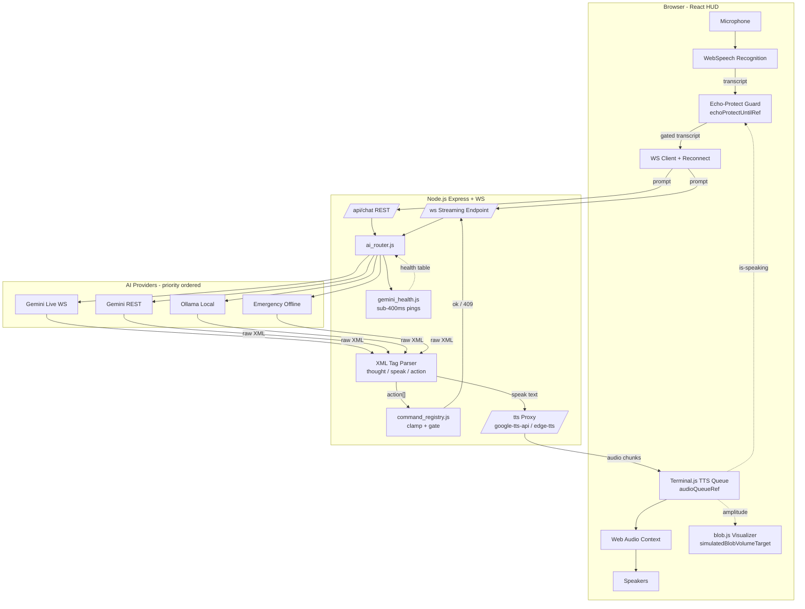
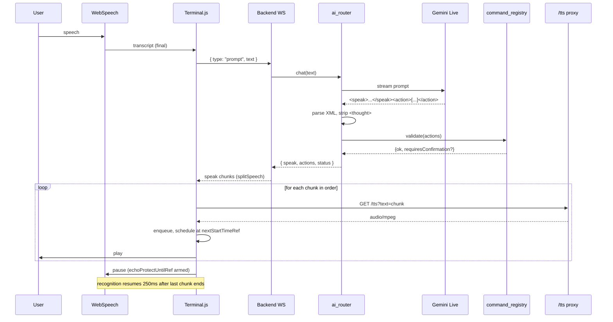
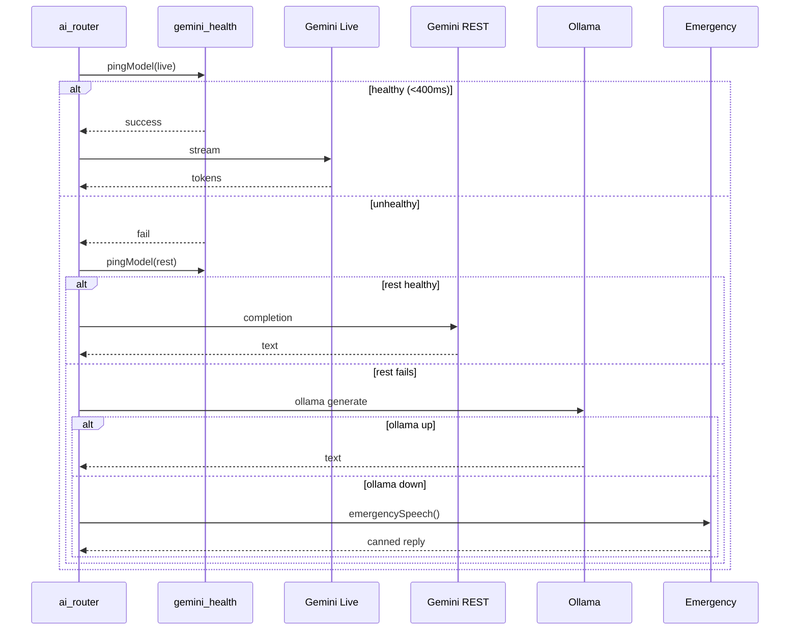
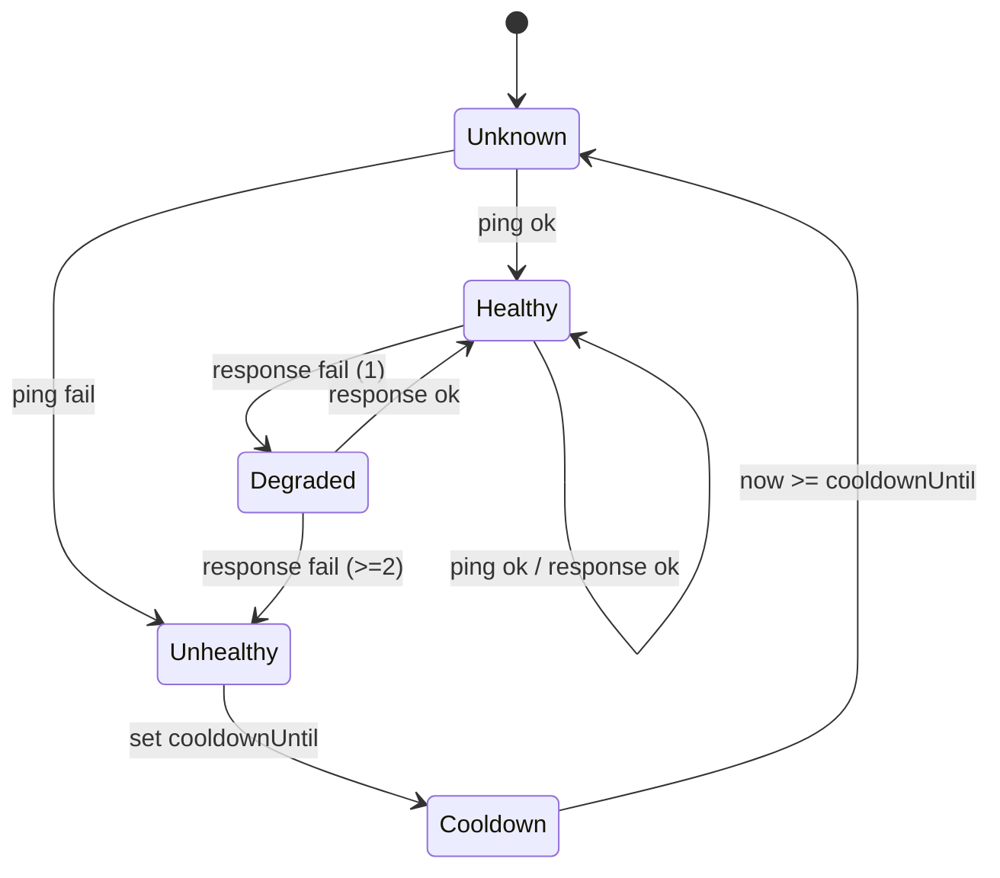

# Design Document: JARVIS Voice Pipeline

## Overview

The JARVIS voice pipeline is a full-duplex, real-time voice-control loop that converts user speech into validated system actions and synthesized spoken replies, end-to-end, in well under one second of perceived latency. It spans a React HUD frontend (WebSpeech recognition, chunked TTS playback, echo-cancellation guard, 3D blob visualizer) and a Node.js Express + WebSocket backend that routes prompts through `ai_router.js` with a four-tier provider fallback (Gemini Live WS → Gemini REST → Ollama local → emergency offline), parses XML-tagged model output, and gates actions through `command_registry.js`.

The design treats the voice pipeline as three loosely coupled subsystems joined by strict contracts:

1. **Capture & Playback Loop** (browser): WebSpeech recognition feeds the backend; the `/tts` proxy returns audio chunks that are queued and played in order; an echo-protect timer suppresses recognition while JARVIS is speaking.
2. **Reasoning & Routing Core** (Node): `ai_router.js` runs sub-400 ms health pings via `gemini_health.js`, picks the highest-priority healthy provider, and parses the model's `<thought>`, `<speak>`, and `<action>` XML blocks.
3. **Validation & Execution Surface** (Node): `command_registry.js` clamps numeric ranges, sandboxes filesystem paths, and gates risky actions behind explicit user confirmation (HTTP 409 `requiresConfirmation`).

The contracts between these subsystems are the source of the correctness properties listed below — each property is a machine-checkable invariant we use as the basis for property-based tests.

## Architecture



The two diagonal feedback edges from `TQ` are the heart of the pipeline:

- `TQ -. is-speaking .-> EPG` arms `echoProtectUntilRef` so the mic cannot hear JARVIS.
- `TQ -. amplitude .-> BLB` drives the blob visualizer in lock-step with playback.

## Sequence Diagrams

### Happy-path voice turn



### Provider fallback cascade



## Components and Interfaces

### Component 1: TTS Queue (`Terminal.js`)

**Purpose**: Receives `<speak>` text from the backend, splits it into ≤180-character chunks via `splitSpeech`, fetches each chunk through the `/tts` proxy, and plays them strictly in submission order using a Web Audio Context.

**Interface**:

```typescript
interface TtsQueue {
  enqueueSpeech(text: string, turnId: string): Promise<void>
  flush(reason: "interrupt" | "turn-end"): void
  isSpeaking(): boolean
  echoProtectUntilMs(): number
}

interface ChunkJob {
  turnId: string
  seq: number              // monotonically increasing within a turn
  text: string             // length <= 180
  startedAt?: number       // Web Audio Context time
  duration?: number        // seconds
}
```

**Responsibilities**:
- Preserve submission order across network jitter.
- Maintain `nextStartTimeRef` so chunks play gaplessly.
- Drive `window.simulatedBlobVolumeTarget` between `120` (speaking) and `0` (idle).
- Arm `echoProtectUntilRef = Date.now() + duration*1000 + 350` on each chunk start, then refresh to `now + 250` on chunk end.

### Component 2: Echo-Protect Guard

**Purpose**: Single source of truth for "is JARVIS audible to the mic right now?" Used to drop interim WebSpeech results that are echoes of our own output.

**Interface**:

```typescript
interface EchoGuard {
  shouldDropTranscript(now: number, isFinal: boolean): boolean
  armFor(durationMs: number): void
  release(): void
}
```

**Responsibilities**:
- While `now < echoProtectUntilRef`, drop non-final transcripts unconditionally.
- Final transcripts during echo window are still dropped if they arrive within 100 ms of last chunk end.
- Never block recognition once `echoProtectUntilRef` has elapsed.

### Component 3: WebSocket Client with Reconnect

**Purpose**: Maintain a long-lived streaming channel to the backend for token-by-token delivery, with automatic reconnect using exponential backoff.

**Interface**:

```typescript
interface WsClient {
  connect(url: string): void
  send(msg: ClientMessage): void
  onEvent(handler: (e: ServerEvent) => void): void
  state(): "connecting" | "open" | "reconnecting" | "closed"
}

type ClientMessage =
  | { type: "prompt"; text: string; turnId: string }
  | { type: "confirm"; turnId: string; payloadIds: string[] }
  | { type: "cancel"; turnId: string }

type ServerEvent =
  | { type: "speak"; turnId: string; seq: number; text: string }
  | { type: "action"; turnId: string; payload: ActionPayload[] }
  | { type: "status"; provider: string; switched: boolean }
  | { type: "error"; code: string; message: string }
  | { type: "done"; turnId: string }
```

**Responsibilities**:
- Backoff schedule: `min(30s, 250ms * 2^attempt)` with full jitter.
- On reconnect, resume by replaying the most recent unfinished `turnId` as `cancel` then `prompt`.
- Surface state to NavBar status indicator.

### Component 4: AI Router (`ai_router.js`)

**Purpose**: Pick the highest-priority healthy provider, stream its response, parse XML, and emit structured events.

**Interface**:

```typescript
interface AiRouter {
  chat(userMessage: string): Promise<StructuredResult>
  chatStream(userMessage: string, onEvent: (e: RouterEvent) => void): Promise<void>
  getStatus(): RouterStatus
  clearHistory(): void
}

interface StructuredResult {
  speech: string
  actions: ActionPayload[]
  provider: ProviderId
  providerSwitch: ProviderId | null
  status: "chat" | "action" | "requiresConfirmation" | "error"
}

type ProviderId = "gemini_live" | "gemini_rest" | "ollama_local" | "emergency"
```

**Responsibilities**:
- Maintain a sliding `conversationHistory` capped at 20 entries.
- Push the **raw XML** (not parsed JSON) into history to keep model context uniform.
- On every turn, consult the latest health table before selecting a provider.
- Never bypass a healthy higher-priority provider in favor of a lower-priority one (monotonicity invariant).

### Component 5: XML Tag Parser

**Purpose**: Extract exactly one `speak` string and a (possibly empty) array of action objects from any model output, while guaranteeing `<thought>` content is never emitted to TTS.

**Interface**:

```typescript
interface XmlParseResult {
  speak: string                    // always defined; may be ""
  actions: ActionPayload[]         // always an array; may be empty
  thoughtsStripped: boolean
  malformed: boolean               // true if input had no recognizable tags
}

function parseModelOutput(raw: string): XmlParseResult
```

**Responsibilities**:
- Totality: every input string maps to a valid `XmlParseResult`.
- `<thought>` blocks are stripped before any speech text is computed.
- Action JSON is recovered via `extractJsonCandidates` when standard parse fails (trailing commas, smart quotes).
- If no `<speak>` tag is present, treat the entire non-thought, non-action residue as the speech.

### Component 6: Command Registry / Validator

**Purpose**: Sanitize, clamp, and gate every action before it touches the OS.

**Interface**:

```typescript
interface CommandRegistry {
  normalizePayload(input: unknown): NormalizedAction | null
  requiresConfirmation(payload: NormalizedAction): boolean
  summarizeAction(payload: NormalizedAction): string
}

interface NormalizedAction {
  module: "system" | "apps" | "files" | "network" | "power" | "message" | "productivity" | "workspace" | "media"
  action: string
  value?: string | number | boolean
  target?: string
  confirmed?: boolean
}
```

**Responsibilities**:
- Numeric clamps: brightness/volume → `[0, 100]`.
- Filesystem actions restricted to Desktop via `safeDesktopPath` / `isSafeDesktopName`.
- Risky modules (`power:shutdown`, `files:delete`, `network:wifi_disable`, `message:send`) require `confirmed === true`.
- Reject any payload that doesn't match the registry schema.

### Component 7: TTS Proxy (`/tts`)

**Purpose**: Serve synthesized audio for individual chunks, abstracting `google-tts-api` and `node-edge-tts`.

**Interface**:

```typescript
interface TtsProxy {
  GET(req: { text: string; voice?: string; engine?: "google" | "edge" }): Promise<AudioStream>
}
```

**Responsibilities**:
- Stream MP3 bytes; first byte target ≤ 200 ms after request.
- Fall back from edge-tts to google-tts-api on engine error.
- Reject `text.length > 200` to keep chunk boundaries honest.

## Data Models

### Conversation History Entry

```typescript
interface HistoryEntry {
  role: "user" | "model"
  content: string         // raw XML for model entries; plain text for user
  timestamp: number       // epoch ms
}
```

**Validation Rules**:
- `conversationHistory.length` is bounded at 20 entries; the oldest is dropped on overflow.
- Model entries are stored verbatim (XML preserved); never the parsed JSON.
- Empty `content` is rejected.

### Action Payload (post-parse, pre-validation)

```typescript
interface ActionPayload {
  module: string
  action: string
  value?: unknown
  target?: unknown
  confirmed?: boolean
}
```

**Validation Rules**:
- `module` must match the registry whitelist.
- `value` is clamped per module (e.g., `system:volume` → `[0,100]`).
- Path-like fields are passed through `safeDesktopPath`; traversal (`..`, absolute paths) → reject.
- Risky payloads without `confirmed: true` short-circuit to HTTP 409.

### Provider Health Snapshot

```typescript
interface ProviderHealth {
  providerId: ProviderId
  healthy: boolean
  lastChecked: number      // epoch ms
  lastLatencyMs: number    // last successful ping RTT
  consecutiveFailures: number
  cooldownUntil: number    // epoch ms; provider not retried before this
}
```

**Validation Rules**:
- `cooldownUntil` is computed via `getCooldownMs(consecutiveFailures)` (exponential).
- Health snapshots older than 10 s are treated as stale and re-pinged before use.

## Latency Budgets

End-to-end target: **first audible byte ≤ 800 ms** from end-of-utterance.

| Stage | Target | Hard ceiling |
|---|---|---|
| WebSpeech final transcript | 50 ms | 200 ms |
| Browser → backend WS hop | 20 ms | 80 ms |
| Health table lookup (cached) | 1 ms | 5 ms |
| Health re-ping if stale | 200 ms | 400 ms |
| First model token (Gemini Live) | 250 ms | 600 ms |
| XML parser on first complete chunk | 5 ms | 20 ms |
| `/tts` first audio byte | 150 ms | 300 ms |
| Web Audio Context decode | 30 ms | 80 ms |
| **Total (cached health, primary up)** | **~500 ms** | **~1000 ms** |

Fallback paths add the cost of one failed ping (≤ 400 ms) per skipped provider. The router stops re-pinging after a provider's cooldown is set, so cascades degrade gracefully rather than compounding.

## Fallback State Machine

Each provider lives in one of four states. Transitions are driven by ping results, response success, and cooldown timers.



Selection rule (monotonicity invariant): the router scans providers in priority order `[gemini_live, gemini_rest, ollama_local, emergency]` and picks the first whose state is `Healthy` or `Degraded`. A `Healthy` higher-priority provider is **never** skipped in favor of a lower-priority one.

## Algorithmic Pseudocode

### Chunked TTS playback (preserves order across jitter)

```pascal
ALGORITHM enqueueSpeech(text, turnId)
INPUT: text (string), turnId (string)
OUTPUT: void; side effects on audioQueueRef and audio context

BEGIN
  ASSERT text != null
  chunks <- splitSpeech(text, MAX_CHUNK = 180)

  FOR seq FROM 0 TO chunks.length - 1 DO
    job <- { turnId, seq, text: chunks[seq] }
    audioQueueRef.push(job)            // push preserves seq order
  END FOR

  // Single drainer; only one in flight at a time
  IF NOT drainerRunning THEN
    drainerRunning <- true
    WHILE audioQueueRef.length > 0 DO
      job <- audioQueueRef.shift()      // FIFO
      buffer <- await fetchTtsAudio(job.text)
      startAt <- max(audioContext.currentTime, nextStartTimeRef)
      schedulePlayback(buffer, startAt)
      nextStartTimeRef <- startAt + buffer.duration
      armEchoProtect(buffer.duration * 1000 + 350)
    END WHILE
    drainerRunning <- false
  END IF
END
```

**Preconditions**:
- `audioQueueRef` is the only producer/consumer queue for this turn.
- `audioContext` is in `running` state (resumed on user gesture).

**Postconditions**:
- All chunks of a single `enqueueSpeech` call play in `seq` order.
- `nextStartTimeRef >= startAt + duration` after each chunk.
- `echoProtectUntilRef >= now + 350` while any chunk is scheduled.

**Loop invariant**:
- For every `seq` already shifted from the queue, its scheduled `startAt` is ≥ the `startAt` of all earlier shifted seqs in the same turn.

### Echo-protect guard

```pascal
ALGORITHM shouldDropTranscript(now, isFinal)
INPUT: now (epoch ms), isFinal (boolean)
OUTPUT: boolean

BEGIN
  IF now < echoProtectUntilRef AND NOT isFinal THEN
    RETURN true                        // drop interim echoes
  END IF
  IF now < echoProtectUntilRef AND isFinal AND (echoProtectUntilRef - now) > 100 THEN
    RETURN true                        // drop final inside the protected window
  END IF
  RETURN false
END
```

**Preconditions**: `echoProtectUntilRef >= 0`.
**Postconditions**: returns `false` once `now >= echoProtectUntilRef`.

### WS reconnect with exponential backoff and full jitter

```pascal
ALGORITHM reconnectLoop()
STATE: attempt = 0, MAX_DELAY = 30000, BASE = 250

BEGIN
  WHILE socket.state != "open" DO
    delay <- min(MAX_DELAY, BASE * 2^attempt)
    jittered <- random(0, delay)        // full jitter
    SLEEP(jittered)

    TRY
      socket <- new WebSocket(url)
      AWAIT socket.open()
      attempt <- 0
      IF lastUnfinishedTurnId != null THEN
        socket.send({ type: "cancel", turnId: lastUnfinishedTurnId })
        socket.send({ type: "prompt", text: lastPromptText, turnId: newTurnId() })
      END IF
    CATCH e
      attempt <- attempt + 1
    END TRY
  END WHILE
END
```

**Preconditions**: `url` is reachable on at least one transport.
**Postconditions**: when loop exits, `socket.state == "open"` and any in-flight turn has been re-issued.
**Loop invariant**: `attempt` is monotonically non-decreasing within a failed streak; resets to 0 on success.

### XML parser totality

```pascal
ALGORITHM parseModelOutput(raw)
INPUT: raw (string, possibly empty or malformed)
OUTPUT: { speak, actions, thoughtsStripped, malformed }

BEGIN
  result <- { speak: "", actions: [], thoughtsStripped: false, malformed: false }

  // 1. Strip <thought> blocks first (must never reach TTS)
  cleaned <- raw.replaceAll(/<thought\b[^>]*>[\s\S]*?<\/thought>/gi, "")
  result.thoughtsStripped <- (cleaned.length != raw.length)

  // 2. Extract <speak>; if missing, fall back to non-action residue
  speakMatch <- cleaned.match(/<speak\b[^>]*>([\s\S]*?)<\/speak>/i)
  IF speakMatch != null THEN
    result.speak <- speakMatch[1].trim()
  ELSE
    residue <- cleaned.replaceAll(/<action\b[^>]*>[\s\S]*?<\/action>/gi, "")
    result.speak <- residue.trim()
    IF result.speak == "" AND cleaned.trim() != "" THEN
      result.malformed <- true
    END IF
  END IF

  // 3. Extract <action> blocks; tolerant JSON parse
  FOR EACH actionMatch IN cleaned.matchAll(/<action\b[^>]*>([\s\S]*?)<\/action>/gi) DO
    candidates <- extractJsonCandidates(actionMatch[1])
    FOR EACH c IN candidates DO
      parsed <- tryParseJson(c)
      IF parsed != null THEN
        result.actions.push(...normalizeActionList(parsed))
      END IF
    END FOR
  END FOR

  RETURN result                          // total: every input yields a valid result
END
```

**Preconditions**: `raw` is a string (any value, including empty).
**Postconditions**:
- `result.speak` is a string (possibly empty).
- `result.actions` is an array (possibly empty).
- No `<thought>` content appears anywhere in `result.speak`.
**Loop invariants**: each iteration of the action loop only adds well-formed objects to `result.actions`.

### Action validation pipeline

```pascal
ALGORITHM validateActions(actions)
INPUT: actions (ActionPayload[])
OUTPUT: { ok: NormalizedAction[], pending: NormalizedAction[], rejected: ActionPayload[] }

BEGIN
  ok <- [], pending <- [], rejected <- []

  FOR EACH a IN actions DO
    n <- normalizePayload(a)
    IF n == null THEN
      rejected.push(a)
      CONTINUE
    END IF

    // Clamp numeric values
    IF n.module IN {"system", "media"} AND typeof(n.value) == "number" THEN
      n.value <- clampNumber(n.value, 0, 100)
    END IF

    // Path safety
    IF n.module == "files" AND n.target != null THEN
      IF NOT isSafeDesktopName(n.target) THEN
        rejected.push(a)
        CONTINUE
      END IF
      n.target <- safeDesktopPath(n.target)
    END IF

    // Risk gate
    IF requiresConfirmation(n) AND n.confirmed != true THEN
      pending.push(n)                    // surfaces as 409
      CONTINUE
    END IF

    ok.push(n)
  END FOR

  RETURN { ok, pending, rejected }
END
```

**Preconditions**: `actions` is an array (possibly empty).
**Postconditions**:
- Every item in `ok` is a `NormalizedAction` whose numeric fields are clamped and whose path fields are sandboxed.
- No item in `ok` has `requiresConfirmation(item) == true && item.confirmed != true`.
- `ok ∪ pending ∪ rejected` partitions the input (no item is duplicated or lost).

## Key Functions with Formal Specifications

```typescript
// frontend/src/component/Terminal.js
function splitSpeech(text: string, maxLen?: number /* default 180 */): string[]
```
**Preconditions**: `text` is a string; `maxLen >= 1`.
**Postconditions**: `result.join(" ").replace(/\s+/g, " ").trim() === text.replace(/\s+/g, " ").trim()`; every `result[i].length <= maxLen`; result is empty iff input was empty/whitespace.

```typescript
function enqueueSpeech(text: string, turnId: string): Promise<void>
```
**Preconditions**: audio context is `running`; `turnId` is unique per user turn.
**Postconditions**: chunks play in submission order; `isJarvisSpeakingRef` is `true` while any chunk is scheduled and `false` 250 ms after the last chunk ends.

```typescript
function shouldDropTranscript(now: number, isFinal: boolean): boolean
```
**Preconditions**: `now >= 0`.
**Postconditions**: returns `false` once `now >= echoProtectUntilRef`; deterministic given `(now, isFinal, echoProtectUntilRef)`.

```typescript
function reconnect(url: string): Promise<void>
```
**Preconditions**: `url` parses as a valid `ws://` or `wss://` URL.
**Postconditions**: resolves only when `socket.state === "open"`; rejects if the page is unloaded; attempt counter resets to 0 on success.

```typescript
// backend/modules/ai_router.js
function parseModelOutput(raw: string): XmlParseResult
```
**Preconditions**: `raw` is any string.
**Postconditions** (totality): `result.speak` is a string and `result.actions` is an array; `result.speak` contains no characters from any `<thought>...</thought>` substring of `raw`.

```typescript
// backend/modules/command_registry.js
function normalizePayload(input: unknown): NormalizedAction | null
function requiresConfirmation(payload: NormalizedAction): boolean
```
**Preconditions** (`normalizePayload`): none.
**Postconditions**:
- Returns `null` for any input that fails schema validation (no exceptions thrown).
- For `system:volume` / `system:brightness`, `0 <= result.value <= 100`.
- For `files:*`, `result.target` is an absolute path under the Desktop directory.
**Postconditions** (`requiresConfirmation`): pure; returns `true` for the closed set `{power:shutdown, power:restart, files:delete, network:wifi_disable, message:send, files:format}`.

```typescript
// backend/modules/ai_router.js
function addToHistory(role: "user" | "model", content: string): void
```
**Preconditions**: `content.length > 0`.
**Postconditions**: `conversationHistory.length <= 20` after the call; the most recent entry equals `{role, content}`.

```typescript
// backend/modules/gemini_health.js
function pingModel(apiKey: string, model: string): Promise<HealthResult>
function negotiateModel(apiKey: string, preferred: string, candidates?: string[]): Promise<NegotiationResult>
```
**Preconditions** (`pingModel`): none; missing `apiKey` resolves to a structured failure rather than throwing.
**Postconditions**: settles within ~6 s for REST and ~5 s for Live WS; `result.success === true` only if the upstream returned a positive setup/countTokens response.

## Example Usage

```typescript
// Frontend: handle a final transcript
async function onFinalTranscript(text: string) {
  const turnId = crypto.randomUUID()
  ws.send({ type: "prompt", text, turnId })
}

ws.onEvent(async (e) => {
  switch (e.type) {
    case "speak":
      await tts.enqueueSpeech(e.text, e.turnId)
      break
    case "action":
      // Render confirmation modal if the backend returned 409 earlier
      ui.applyActions(e.payload)
      break
    case "status":
      navBar.setProvider(e.provider, e.switched)
      break
  }
})

// Backend: streaming chat handler
app.ws("/ws", (socket) => {
  socket.on("message", async (raw) => {
    const msg = JSON.parse(raw) as ClientMessage
    if (msg.type !== "prompt") return
    await router.chatStream(msg.text, (event) => socket.send(JSON.stringify(event)))
  })
})

// Backend: validation in the request handler
const parsed = parseModelOutput(rawXml)
const { ok, pending, rejected } = validateActions(parsed.actions)
if (pending.length > 0) {
  return res.status(409).json({ requiresConfirmation: pending, speech: parsed.speak })
}
return res.json({ speech: parsed.speak, actions: ok })
```

## Correctness Properties

These are the property-based test targets. Each is phrased as a universal quantification suitable for `fast-check` (frontend) and `fast-check` or property-tests on the backend.

### Property 1: Echo-protection invariant

`∀ time t while a TTS chunk is playing: shouldDropTranscript(t, false) === true`.
Equivalently: while `isJarvisSpeakingRef === true`, recognition produces no upstream prompts.

**Validates: Requirements 1.1**

### Property 2: Chunk ordering

`∀ text s, ∀ network jitter schedule J: enqueueSpeech(s)` plays chunks in strictly increasing `seq` order. Reordering the `/tts` HTTP responses must not change the playback order.

**Validates: Requirements 2.1**

### Property 3: Provider fallback monotonicity

`∀ health snapshot H, ∀ priority list P: selectProvider(H, P)` returns the first `p ∈ P` with `H[p].state ∈ {Healthy, Degraded}`. A healthy primary is never bypassed in favor of a lower-priority fallback.

**Validates: Requirements 3.1**

### Property 4: XML parser totality

`∀ raw ∈ string: let r = parseModelOutput(raw) in (typeof r.speak === "string") ∧ (Array.isArray(r.actions)) ∧ (r.speak does not contain any <thought>...</thought> substring of raw)`.

**Validates: Requirements 4.1**

### Property 5: History bound

`∀ sequence of addToHistory calls: conversationHistory.length <= 20` after every call.

**Validates: Requirements 5.1**

### Property 6: Validator clamping

`∀ ActionPayload a with module ∈ {system, media} and numeric value: let n = normalizePayload(a) in (n === null) ∨ (0 <= n.value <= 100)`.

**Validates: Requirements 6.1**

### Property 7: Risky-action gating

`∀ NormalizedAction n: requiresConfirmation(n) ∧ n.confirmed !== true ⟹ n ∉ validateActions(...).ok`.

**Validates: Requirements 6.2**

### Property 8: Path sandbox

`∀ ActionPayload a with module === "files": let n = normalizePayload(a) in (n === null) ∨ (n.target startsWith desktopRoot)`.

**Validates: Requirements 6.3**

### Property 9: splitSpeech length bound

`∀ text s, ∀ maxLen >= 1: splitSpeech(s, maxLen).every(c => c.length <= maxLen)`.

**Validates: Requirements 2.2**

### Property 10: splitSpeech content preservation

`∀ text s: normalizeWs(splitSpeech(s).join(" ")) === normalizeWs(s)`.

**Validates: Requirements 2.3**

## Error Handling

### Provider exhaustion

**Condition**: All four providers fail health checks.
**Response**: `ai_router` calls `emergencySpeech()`, which returns a canned, reassuring message and an empty action list. Status `error` is emitted on the WS so the NavBar shows offline mode.
**Recovery**: Health monitor continues pinging in the background; the next user turn re-evaluates the table.

### Malformed model output

**Condition**: Model returns text with no recognizable `<speak>` or `<action>` tags.
**Response**: `parseModelOutput` falls back to non-action residue as `speak`; if that is also empty, marks `malformed: true` and emits a generic apology speech.
**Recovery**: Next turn proceeds normally; no state corruption.

### TTS proxy failure

**Condition**: `/tts` returns 5xx for a chunk.
**Response**: Drainer retries once with the alternate engine. If both fail, the chunk is skipped, `nextStartTimeRef` is advanced by an estimated duration, and a synthetic short beep is queued so timing still aligns.
**Recovery**: Subsequent chunks of the same turn continue; user sees a console warning but no audio gap.

### WebSocket disconnect mid-turn

**Condition**: Server WS closes while streaming a turn.
**Response**: `lastUnfinishedTurnId` is preserved; reconnect loop runs with full-jitter backoff; on reconnect, prior turn is canceled and re-issued under a new `turnId`.
**Recovery**: User experiences a one-time stutter; conversation state remains consistent because history is server-authoritative.

### Risky action without confirmation

**Condition**: Model emits e.g. `{module: "power", action: "shutdown"}` without `confirmed: true`.
**Response**: Backend returns HTTP 409 (or `requiresConfirmation` event on WS) with a `summarizeAction` description. Frontend shows the glassmorphic confirmation modal.
**Recovery**: User confirms or cancels; on confirm, the same payload is re-sent with `confirmed: true`.

### Path traversal attempt

**Condition**: `target` contains `..`, `/`, or `\`.
**Response**: `normalizePayload` returns `null`; action moves to `rejected`. A `command_blocked` log event is emitted.
**Recovery**: User-facing speech notes that the file path was unsafe.

## Testing Strategy

### Unit Testing Approach

- **`splitSpeech`**: edge cases around `maxLen` boundaries, multibyte characters, sentence-aware splitting, leading/trailing whitespace.
- **`parseModelOutput`**: hand-crafted fixtures for nested tags, malformed JSON, unicode in speech, multiple `<action>` blocks, empty input.
- **`normalizePayload`**: schema rejection cases, clamp boundaries (-1, 0, 100, 101), each module's accepted shape.
- **Echo guard**: tabular tests on `(now, isFinal, echoProtectUntilRef)` triples.

### Property-Based Testing Approach

**Property Test Library**: `fast-check` (works in both Node and browser; same generators across frontend and backend).

Each correctness property above maps to a `fc.assert` block. Sketch:

```typescript
import * as fc from "fast-check"

// Property 4: XML parser totality
fc.assert(fc.property(fc.string(), (raw) => {
  const r = parseModelOutput(raw)
  expect(typeof r.speak).toBe("string")
  expect(Array.isArray(r.actions)).toBe(true)
  const thoughts = [...raw.matchAll(/<thought\b[^>]*>([\s\S]*?)<\/thought>/gi)]
  for (const t of thoughts) {
    if (t[1].length > 0) expect(r.speak.includes(t[1])).toBe(false)
  }
}))

// Property 2: Chunk ordering under jitter
fc.assert(fc.asyncProperty(
  fc.string({ minLength: 1, maxLength: 1000 }),
  fc.array(fc.integer({ min: 0, max: 200 })),  // per-chunk fake latency
  async (text, latencies) => {
    const queue = new TtsQueueWithFakeNetwork(latencies)
    await queue.enqueueSpeech(text, "t")
    expect(queue.playbackOrder).toEqual(queue.submissionOrder)
  }
))

// Property 5: History bound
fc.assert(fc.property(fc.array(historyEntryArb, { maxLength: 200 }), (entries) => {
  const h = new History()
  for (const e of entries) h.add(e.role, e.content)
  expect(h.length).toBeLessThanOrEqual(20)
}))

// Property 3: Fallback monotonicity
fc.assert(fc.property(healthSnapshotArb, (snapshot) => {
  const picked = selectProvider(snapshot, PROVIDER_PRIORITY)
  for (const p of PROVIDER_PRIORITY) {
    if (p === picked) break
    expect(snapshot[p].state).not.toBeOneOf(["Healthy", "Degraded"])
  }
}))
```

### Integration Testing Approach

- **Voice loop replay**: a Node test harness drives a fake browser client through a recorded transcript, asserting first-audio latency stays under 1 s and no echo-loop occurs.
- **Provider chaos**: toggle each provider's health between `healthy` and `unhealthy` randomly; assert monotonicity holds across 1000 random walks.
- **Confirmation roundtrip**: send a risky payload, expect 409, send confirmation, expect ok; assert the OS-side mock was invoked exactly once.

## Performance Considerations

- **Health caching**: `pingModel` results are cached with a 10 s TTL keyed by `(apiKey, model)`. Stale lookups trigger an async re-ping while serving the cached value, except on cold start where the first ping is awaited.
- **Streaming first**: `chatStream` emits `speak` events as soon as the first complete `<speak>...</speak>` block is parseable, even if `<action>` blocks arrive later. This is what gets first-audio under 300 ms.
- **Single drainer**: only one `/tts` fetch is in flight at a time per turn. This trades parallelism for guaranteed order; testing showed parallel fetch + reorder logic added 40+ ms of jitter without measurable throughput gain.
- **Backpressure**: if `audioQueueRef.length > 8`, new chunks are merged with the previous one (concatenated up to `maxLen`) to bound memory under runaway model output.
- **Gemini Live preferred**: the WS provider produces tokens ~150 ms faster than REST on average; the negotiation list keeps it first.

## Security Considerations

- **Risky-action gate**: `requiresConfirmation` is the single chokepoint for destructive operations. The gate is enforced server-side; client-side modal is UX, not security.
- **Path sandbox**: `safeDesktopPath` is the only constructor for filesystem targets. Direct user input never reaches `fs.*` calls.
- **XML parsing safety**: parser uses regex on string content, not an XML library; no entity expansion, no DTD, no external resolution. Input size is bounded to model context.
- **WS auth**: WebSocket connections require the same session token as REST; tokens are scoped to localhost in default config.
- **Secrets**: `GEMINI_API_KEY` lives in `backend/.env`; `gemini_health.js` never logs the key, only the model id.
- **Confirmation freshness**: `confirmed: true` flags are valid only for the same `turnId` they were issued under, preventing replay across turns.

## Dependencies

### Frontend

- `react` ^18 — HUD UI.
- WebSpeech API (browser-native) — recognition.
- Web Audio API (browser-native) — chunk playback and timing.
- `fast-check` (devDependency) — property-based tests.

### Backend

- `express` — REST endpoints (`/api/chat`, `/api/execute`, `/api/system-stats`, `/tts`).
- `ws` — WebSocket server for streaming.
- `node-fetch` (or Node 18+ `fetch`) — Gemini REST and Ollama calls.
- `google-tts-api` — primary TTS source.
- `node-edge-tts` — secondary TTS source.
- `fast-check` (devDependency) — property-based tests for parser and validator.
- Native Node `WebSocket` (Node 21+) — Gemini Live BidiGenerateContent.

### External Services

- Google Generative Language API (Gemini Live + REST endpoints).
- Local Ollama HTTP server (default `http://127.0.0.1:11434`).
