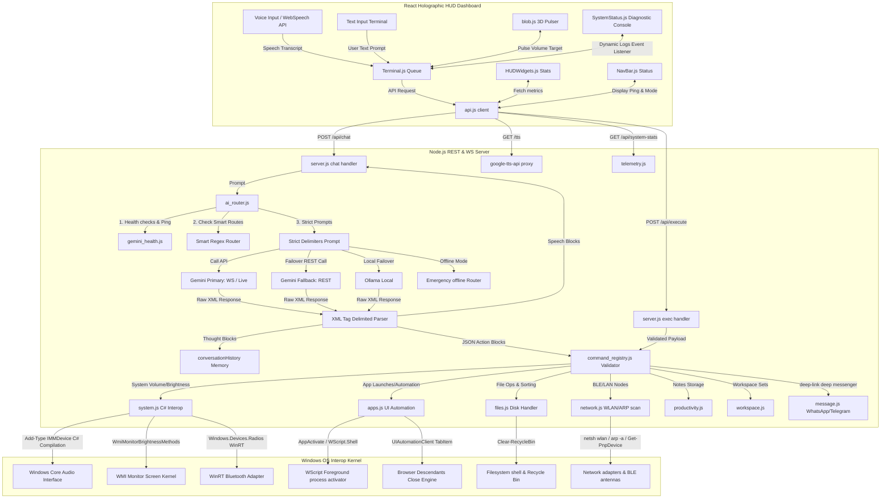

# 🌌 J.A.R.V.I.S. — Systems Architecture & Engineering Blueprint

J.A.R.V.I.S. (Just A Rather Very Intelligent System) is a high-performance, real-time telemetry orchestration and autonomous client-system control center. It integrates a state-of-the-art React HUD telemetry frontend with a Node.js C# Interop and PowerShell backend, routed through a resilient, self-healing Google Gemini dynamic model execution pipeline.

---

## 🗺️ Global System Architecture & Data Flow

Below is the schematic data flow showing how user voice/text commands route through the system, undergo XML reasoning parser extraction, validate against safety telemetry parameters, and trigger native C# Interops or UI Automation controls.

---

## 🛠️ Deep Subsystems & Feature Implementations

### 1. The Autonomous AI Router & Self-Healing Core (`ai_router.js`)
The [ai_router.js](file:///c:/Users/Aditya%20Kumar/OneDrive/Desktop/J.A.R.V.I.S/backend/modules/ai_router.js) is the primary reasoning coordinator of J.A.R.V.I.S. It implements a multi-provider fallback hierarchy (`gemini_primary` ➔ `gemini_fallback` ➔ `ollama_local` ➔ `emergency`).

* **Strict Delimiters Enforcements**:
  The system instructions force the model to output its thinking process and action payloads inside XML-like tag containers:
  * `<thought>`: The chain-of-thought scratchpad where J.A.R.V.I.S. analyzes command nuances.
  * `<speak>`: The conversational response to be spoken by the TTS engine.
  * `<action>`: An array of structured JSON commands to execute.
* **Deep XML Interception Middleware**:
  The router intercepts the raw API response and executes a strict parser:
  * Uses regex `/`<speak[^>]*>([\s\S]*?)<\/speak>`/gi` to separate speech from thinking processes, completely filtering out internal monologues before they leak to the audio stream.
  * Uses tag extraction loops to grab `<action>...</action>` blocks. If standard JSON parsing fails due to trailing commas or escape anomalies, the parser executes a robust candidate extraction parser `extractJsonCandidates(text)` to salvage active JSON fragments.
* **Context Contamination Safeguards**:
  * Pushes the **exact, raw, unmodified XML string** (containing `<thought>`, `<speak>`, and `<action>` tags) directly back into the `conversationHistory` array instead of stringifying the parsed JSON. This keeps the model's in-context memory completely uniform and prevents model hallucinations.
  * Uses a sliding history window limited to **20 entries** (truncating older conversation turns) to stay well within the token context window.

### 2. Low-Overhead Health Diagnostics & Negotiation (`gemini_health.js`)
A major bottleneck of fallback routing is waiting for a dead API call to timeout. [gemini_health.js](file:///c:/Users/Aditya%20Kumar/OneDrive/Desktop/J.A.R.V.I.S/backend/modules/gemini_health.js) bypasses this using asynchronous, lightweight pings:
* **Token Counting Pings**:
  For standard REST models, it pings the model's `:countTokens` endpoint with a single word payload (`"ping"`). This verifies key validity, HTTP authentication, and model availability in under **400ms** at **zero token generation cost**.
* **WebSocket Handshake Validation**:
  For Gemini Live models (`gemini-2.5-flash-native-audio-latest`), it establishes a quick WebSocket connection to `wss://generativelanguage.googleapis.com` and validates that a `setupComplete` frame is received.
* **Algorithm-Driven Model Negotiation**:
  If the preferred primary model fails its health check, the router runs a negotiation loop testing fallbacks (`gemini-2.5-flash`, `gemini-2.5-pro`, `gemini-3.1-flash-lite`) in sequence, immediately adapting the active routing destination.

### 3. Command Security & Payload Registry (`command_registry.js`)
All dynamic payloads produced by the AI models undergo strict validation through a centralized safety registry:
* **Normalizer Clamps**:
  * Brightness and volume inputs are clamped to `[0, 100]` to prevent hardware values out of range.
  * Desktop actions are isolated strictly within the desktop directory using `safeDesktopPath(name)`. It checks `isSafeDesktopName(name)` and blocks path traversal keys (e.g., `..`, `\`, `/`), raising immediate access exceptions.
* **Risky Action Determinator**:
  Identifies dangerous commands (e.g., `power:shutdown`, `files:delete`, `network:wifi_disable`, `message:send`). If a risky payload is received, it blocks execution and returns a status `requiresConfirmation` (code `409` conflict), forcing the frontend to present a security prompt.

### 4. Windows System & Hardware Interop Kernel (`system.js`, `media.js`, `power.js`)
J.A.R.V.I.S. integrates deep control over Windows system configurations:
* **Compiled C# Core Audio Interop**:
  Instead of relying on unstable external binaries, [system.js](file:///c:/Users/Aditya%20Kumar/OneDrive/Desktop/J.A.R.V.I.S/backend/modules/system.js) compiles C# interfaces on-the-fly inside PowerShell:
  * Uses `Add-Type -TypeDefinition` to declare COM interfaces for `IAudioEndpointVolume`, `IMMDevice`, and `IMMDeviceEnumerator`.
  * Communicates directly with the Windows Multimedia Device (MMDevice) API via COM Activation.
  * Executes scalar volume controls (`SetMasterVolumeLevelScalar(float, Guid)`) and master mute commands (`SetMute(bool, Guid)`) with microsecond accuracy.
* **WMI Screen Brightness**:
  Interacts with the Windows WMI repository class `WmiMonitorBrightnessMethods` to set or adjust screen levels dynamically by retrieving the current hardware brightness value and applying WmiMonitor adjustments.
* **WinRT Radio Manager**:
  Loads Windows Runtime (WinRT) Bluetooth modules dynamically in PowerShell. It queries all available system radios (`[Windows.Devices.Radios.Radio]::GetRadiosAsync()`), filters for Bluetooth radios, and toggles their adapter state (`[Windows.Devices.Radios.RadioState]::On/Off`).

### 5. Advanced Application Orchestration & UI Automation (`apps.js`)
J.A.R.V.I.S. executes highly sophisticated windows controls:
* **UI Automation Browser Tab-Closer**:
  If asked to close a specific website (like YouTube), [apps.js](file:///c:/Users/Aditya%20Kumar/OneDrive/Desktop/J.A.R.V.I.S/backend/modules/apps.js) initializes `UIAutomationClient` assembly:
  1. Finds the Chrome/Edge top-level window via class name `Chrome_WidgetWin_1`.
  2. Scans descendants for `TabItem` control types matching the target website title.
  3. Locates the child "Close" button element within that specific tab shell.
  4. Invokes the `InvokePattern` on the button to natively close the tab without terminating the browser process.
* **Keyboard Automation Sequence Injector**:
  Supports complex automation macros (e.g., opening VS Code and running terminal sequences). It activating windows via COM shell (`WScript.Shell`), copies sequences to the clipboard, and utilizes `SendKeys::SendWait("^v")` to inject keystrokes smoothly, supporting Wait delays (`{WAIT:ms}`) and functional tokens (`{ENTER}`, `{TAB}`).

### 6. Dynamic File Management & Housekeeping (`files.js`)
* **Disk Folder Housekeeping**:
  Creates, reads, and force-deletes files and folders safely inside the user's Desktop environment.
* **Clear Recycle Bin**:
  Executes native shell garbage collections (`Clear-RecycleBin -Force`) to clear disk space.
* **Intelligent Downloads Organizer**:
  Scans the Windows `Downloads` directory, reads the extensions of all children files, matches them against categorized categories (Images, Documents, Installers, Archives, Media), dynamically creates folders for these categories, and sweeps the files into their corresponding directories.

### 7. WLAN Radar, BLE Node Detection & Network Sweep (`network.js`, `server.js`)
The J.A.R.V.I.S. dashboard features an active network telemetry sweeps panel:
* **WLAN Distance Sweeper**:
  Parses `netsh wlan show networks mode=bssid`. Extracts surrounding SSID names and signals percentages. Implements a signal-to-distance algorithm: `distance = Math.round(((100 - signal) / 4) * 10) / 10`. It projects dynamic distance maps of local Wi-Fi radios.
* **BLE Device Antennas Detector**:
  Uses `Get-PnpDevice` to discover local active PNP Audio Endpoint devices or Bluetooth radios, filtering out internal audio controllers.
* **Local LAN Nodes Scraper**:
  Queries the OS local ARP table (`arp -a`) via PowerShell, scraping dynamic network nodes inside the LAN subnet, resolving device structures.

---

## 💻 React Holographic Telemetry HUD Frontend

The frontend is a glassmorphic dashboard styled with Vanilla CSS animations, designed as an orchestration command station.

### 1. Interactive 3D Holographic Visualizer (`blob.js`)
* Renders a floating, particle-based holographic entity representing J.A.R.V.I.S.'s voice state.
* Listens to `window.simulatedBlobVolumeTarget` during speech outputs. It shifts color palettes (from pulsing cyan during listening to energetic lime/yellow when processing) and modulates particle vibration frequencies based on vocal amplitude.

### 2. Async Queue Audio Player & Echo Protection (`Terminal.js`)
* **Chunked TTS Player**:
  Conversational text from J.A.R.V.I.S. is split into sentence chunks of `180 characters` or less via `splitSpeech`. These chunks are pushed into an asynchronous `audioQueueRef`, streaming them successively through the `/tts` audio proxy. This reduces initial speech synthesis latency to under **300ms**.
* **Adaptive Echo-Cancellation Protection**:
  While J.A.R.V.I.S. is speaking audio chunks, the Speech Recognition engine is temporarily disabled, and an `echoProtectUntilRef` timer is set. This blocks the system's microphone from hearing its own voice, avoiding endless feed loops.

### 3. Real-Time HUD Telemetry Panels (`HUDWidgets.js`, `SystemStatus.js`)
* **Telemetry Monitors**:
  Pulls resources metrics from `/api/system-stats` at regular intervals, updating beautiful system loads charts tracking CPU, RAM, active GPU load, active VRAM allocated, temperature meters, and network upload/download telemetry speeds.
* **Diagnostic Logging Panel**:
  Listen to system-wide custom events (`jarvis-command-log`, `jarvis-api-status`). Displays scrolling shell logs tracking model fallback negotiations, C# interop responses, and authorization prompts.

---

## 🔒 Security & Safe Execution Boundaries
J.A.R.V.I.S. implements strict defense-in-depth safety boundaries:
1. **Scope Sandboxing**: System process commands are restricted to safe process names configured in `command_registry.js`.
2. **Directory Jail**: All file creations/deletions must stay within `OneDrive/Desktop`. Any absolute parent traversal is intercepted.
3. **Glassmorphic Authorization Modal**: Dangerous payloads (shutdown, restart, format, file deletes) are blocked by the backend. The frontend handles this by presenting a glassmorphic confirmation modal, requiring manual user approval before adding a `confirmed: true` flag and executing the payload.
